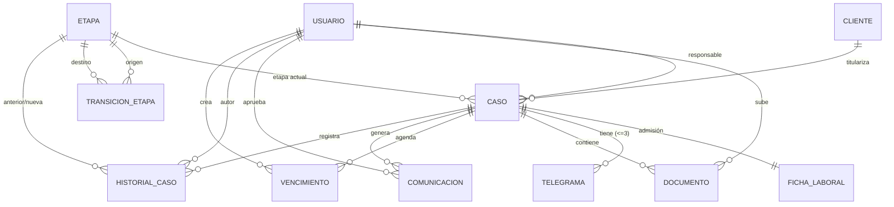

# Modelo de Datos — Guía de Relaciones

Esta guía explica el modelo de datos de Iuris para que pueda entenderse y mantenerse sin leer el DDL completo. La **fuente de verdad** del esquema es [`modelo-de-datos.dbml`](./modelo-de-datos.dbml) (visualizable en dbdiagram.io); este documento explica qué significa cada relación y qué reglas deben respetarse al implementar.

> Contexto del dominio en `../../INFORME_RELEVAMIENTO.md`. Reglas de negocio en `../01-requisitos/reglas-de-negocio.md`.

## Principios de diseño (leer antes de tocar el modelo)

1. **Los estados del caso son datos, no un enum.** Cada área (Laboral, ART) tiene su propio ciclo de vida con muchas etapas. Por eso el estado se modela con las tablas `etapa` (catálogo) y `transicion_etapa` (transiciones permitidas), y el caso apunta a su `etapa_actual_id`. Agregar o cambiar etapas es **cargar datos**, no modificar código.
2. **El historial es inmutable.** `historial_caso` solo admite inserciones; nunca se actualiza ni se borra (RN-05, RN-06).
3. **La IA solo produce borradores.** `comunicacion` guarda borradores que un humano revisa y aprueba; el envío (por WhatsApp) es externo y manual (RN-10).
4. **Los documentos los sube el abogado.** `documento.subido_por` siempre referencia a un `usuario`; el cliente nunca carga archivos.

## Entidades

| Tabla | Rol en el sistema |
|-------|-------------------|
| `usuario` | Personal del estudio (todos abogados). Roles SOCIO / ABOGADO. |
| `cliente` | Persona representada. Incluye datos de la persona del formulario de admisión. |
| `caso` | Expediente. Núcleo del sistema; apunta a su etapa actual. |
| `ficha_laboral` | Datos del trabajo y registración (resto del formulario de admisión). 1:1 con el caso. |
| `etapa` | Catálogo configurable de etapas por área y fase. |
| `transicion_etapa` | Transiciones permitidas entre etapas (el grafo del flujo). |
| `historial_caso` | Bitácora inmutable de avances/retrocesos de etapa. |
| `telegrama` | Telegramas del flujo Laboral (Ley 23.789), hasta 3 por caso, con su resultado de entrega. |
| `documento` | Archivos del caso (categoría + formato). |
| `vencimiento` | Ítems de agenda / movimientos a realizar (vista calendario). |
| `comunicacion` | Borradores de mensajes al cliente (batch IA + manuales). |
| `backup` | Historial de respaldos (los ejecuta n8n). Tabla independiente, sin relaciones. |

## Relaciones (cardinalidad y significado)

Notación: `A → B` significa que la clave foránea vive en A y apunta a B.

| Relación (FK) | Cardinalidad | Significado |
|---------------|--------------|-------------|
| `caso.cliente_id → cliente.id` | N:1 | Un cliente puede tener muchos casos; cada caso pertenece a un solo cliente. |
| `caso.abogado_responsable_id → usuario.id` | N:1 | Cada caso tiene un abogado responsable; un abogado lleva muchos casos. (Todos pueden *leer* todos los casos; esta FK indica titularidad, no visibilidad.) |
| `caso.etapa_actual_id → etapa.id` | N:1 | Cada caso está parado en una etapa; una etapa puede ser la actual de muchos casos. |
| `ficha_laboral.caso_id → caso.id` | 1:1 | Cada caso tiene a lo sumo una ficha de admisión (`caso_id` es único). |
| `transicion_etapa.etapa_origen_id → etapa.id` | N:1 | Auto-relación de `etapa`: define desde qué etapa se puede salir. |
| `transicion_etapa.etapa_destino_id → etapa.id` | N:1 | …y hacia qué etapa se puede ir. Juntas forman un grafo N:M sobre `etapa`. |
| `historial_caso.caso_id → caso.id` | N:1 | Un caso acumula muchas entradas de historial. |
| `historial_caso.etapa_anterior_id → etapa.id` | N:1 | Etapa de la que se venía (NULL al crear el caso). |
| `historial_caso.etapa_nueva_id → etapa.id` | N:1 | Etapa a la que se pasó. |
| `historial_caso.autor_id → usuario.id` | N:1 | Quién registró el movimiento. |
| `telegrama.caso_id → caso.id` | N:1 | Un caso Laboral tiene hasta 3 telegramas (único `caso_id + numero`). |
| `documento.caso_id → caso.id` | N:1 | Un caso contiene muchos documentos. |
| `documento.subido_por → usuario.id` | N:1 | Quién subió el archivo (siempre un abogado). |
| `vencimiento.caso_id → caso.id` | N:1 | Un caso puede tener muchos vencimientos/ítems de agenda. |
| `vencimiento.creado_por → usuario.id` | N:1 | Quién creó el ítem (opcional). |
| `comunicacion.caso_id → caso.id` | N:1 | Un caso acumula muchos borradores de comunicación. |
| `comunicacion.aprobado_por → usuario.id` | N:1 | Quién aprobó el borrador (NULL mientras está pendiente). |
| `refresh_token.usuario_id → usuario.id` | N:1 | Sesiones (refresh tokens) de un usuario, para revocación. |

`usuario` 1:1 conceptual con el perfil profesional (se fusionaron en una sola tabla porque todo el personal es abogado).

## Diagrama (vista rápida)

## Cómo funciona la máquina de estados

El estado de un caso es su `etapa_actual_id`. Para mover un caso:

1. **Avanzar:** verificar que exista una fila en `transicion_etapa` con `(etapa_origen_id = etapa_actual, etapa_destino_id = destino)`. Si existe, actualizar `caso.etapa_actual_id` e **insertar** una fila en `historial_caso` (`etapa_anterior`, `etapa_nueva`, `autor`, `evento = 'AVANCE'`).
2. **Retroceder:** permitido **con confirmación** del usuario (salvaguarda ante errores). Se registra igual en `historial_caso` con `evento = 'RETROCESO'`.
3. **Etapas terminales:** si `etapa.es_terminal = true` (Acuerdo, Indemnización, Sentencia), el caso está cerrado y no admite nuevos avances.

## Invariantes a respetar en la capa de servicio

Algunas reglas no las puede garantizar la base por sí sola; deben validarse en el backend:

- `caso.etapa_actual_id` debe apuntar a una `etapa` cuya `area` coincida con `caso.area`. (No mezclar etapas de Laboral con casos ART.)
- `caso.tipo_reclamo` se completa **solo** cuando `area = ART`; es NULL en Laboral.
- `telegrama` solo aplica a casos del área Laboral.
- `ficha_laboral` es 1:1: no crear más de una por caso.
- `historial_caso` es **append-only**: jamás `UPDATE` ni `DELETE`.
- `documento.subido_por` siempre es un `usuario`; no existe carga por parte del cliente.
- `comunicacion` no se envía automáticamente: el cambio a `APROBADO` lo hace una persona.
