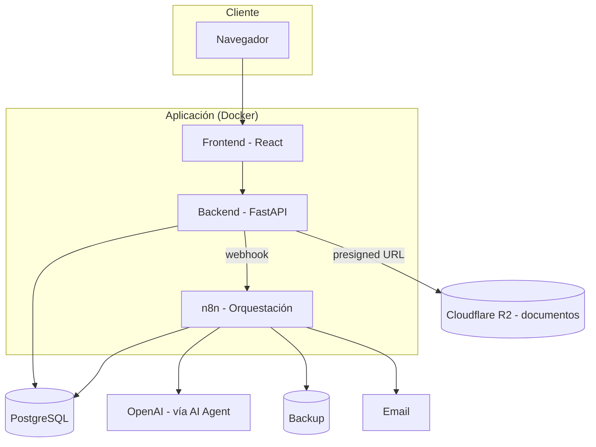
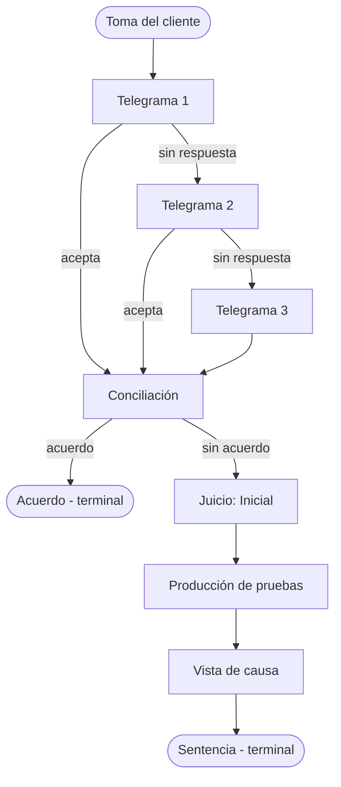
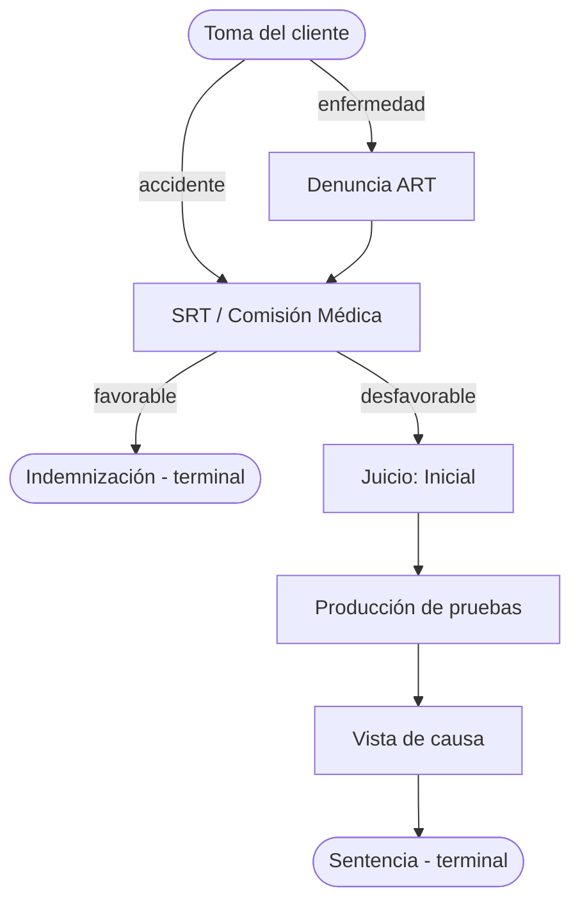
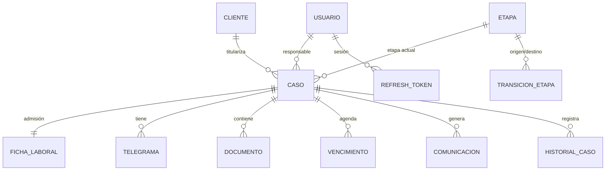
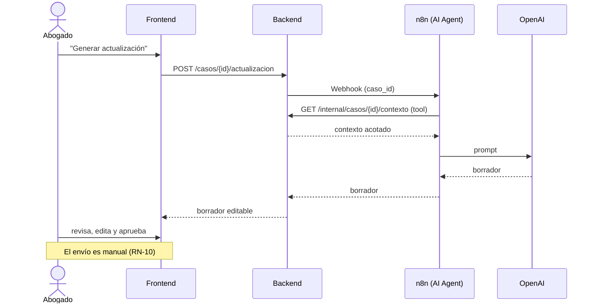

# Diagramas

Diagramas en Mermaid (se renderizan en GitHub/GitLab/VSCode).

## Componentes / despliegue

## Ciclo de vida — LABORAL

## Ciclo de vida — ART

## Modelo entidad-relación (resumen)

## Secuencia — generación de actualización (IA asistencial)

