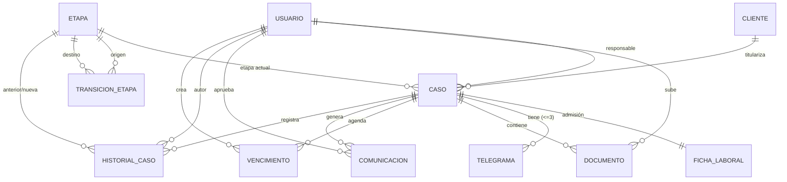

<div align="center">

# ⚖️ IURIS

### Sistema de Gestión Jurídica para Estudios Laborales y ART

*Plataforma de gestión integral de expedientes jurídicos con generación asistida de comunicaciones mediante inteligencia artificial bajo supervisión humana.*

[]()
[]()
[]()
[]()
[]()
[]()

**Universidad Tecnológica Nacional — Facultad Regional Mendoza**

**Tecnicatura Universitaria en Programación · Proyecto Final · Comisión 3**

</div>

---

## 📑 Índice

1. [Resumen](#-resumen)
2. [Contexto y motivación](#-contexto-y-motivación)
3. [Objetivos](#-objetivos)
4. [Alcance](#-alcance)
5. [Arquitectura general](#️-arquitectura-general)
6. [Stack tecnológico](#-stack-tecnológico)
7. [Modelo de datos](#-modelo-de-datos)
8. [Principios de diseño](#️-principios-de-diseño)
9. [Metodología](#-metodología)
10. [Decisiones de arquitectura (ADR)](#-decisiones-de-arquitectura-adr)
11. [Estructura del repositorio](#-estructura-del-repositorio)
12. [Instalación y ejecución](#️-instalación-y-ejecución)
13. [Trabajo futuro](#-trabajo-futuro)
14. [Equipo y contexto académico](#-equipo-y-contexto-académico)

---

## 📄 Resumen

**Iuris** es una plataforma de gestión jurídica desarrollada como Proyecto Final para un estudio de abogados real de la provincia de Mendoza, especializado en derecho **Laboral** y **ART** (accidentes y enfermedades laborales).

El sistema centraliza la administración de expedientes, modela los flujos procesales propios de cada área como datos configurables, y asiste a los profesionales en la redacción de comunicaciones mediante inteligencia artificial. Un principio rige toda la arquitectura: **la IA es asistiva, nunca autónoma**. Ningún mensaje se envía a un cliente de forma automática; el abogado siempre revisa y aprueba los borradores antes de su envío (*human-in-the-loop*).

El proyecto se desarrolló bajo una metodología de **Desarrollo Guiado por Especificaciones (SDD)** con iteración ágil, produciendo en paralelo los artefactos de código y la documentación académica.

---

## 🎯 Contexto y motivación

El estudio jurídico cliente gestionaba sus expedientes de forma dispersa, sin una herramienta que reflejara la complejidad real de los procesos laborales y de ART. A partir de un relevamiento de requerimientos con el cliente, se identificaron dos problemas centrales:

- **Heterogeneidad de los flujos procesales.** Los casos *Laboral* y *ART* siguen recorridos distintos, con fases extrajudiciales y judiciales, múltiples ramificaciones y vencimientos críticos. Un modelo de estados rígido no alcanza para representarlos.
- **Carga operativa en las comunicaciones.** La redacción de telegramas laborales (Ley 23.789) y de actualizaciones periódicas a los clientes es repetitiva y propensa a errores, pero exige criterio profesional y no puede automatizarse por completo.

Iuris responde a ambos problemas: modela los estados como datos configurables por área y emplea IA para **generar borradores** que el abogado controla y aprueba.

El estudio opera con dos roles internos, ambos ejercidos por abogados:

| Rol | Permisos |
|-----|----------|
| **SOCIO** | Acceso total, incluida la gestión de usuarios |
| **ABOGADO** | Acceso operativo completo |

---

## 🎯 Objetivos

### Objetivo general

Desarrollar una plataforma web que centralice la gestión de expedientes laborales y de ART de un estudio jurídico, incorporando generación asistida de comunicaciones mediante IA bajo supervisión humana.

### Objetivos específicos

- Digitalizar y centralizar la información de clientes, casos y documentación.
- Modelar flujos procesales **configurables por área legal**, sin necesidad de redesplegar el sistema ante cambios de proceso.
- Implementar la generación asistida de telegramas (Ley 23.789) y de comunicaciones periódicas con clientes.
- Garantizar la **trazabilidad e inmutabilidad** del historial de cada expediente.
- Asegurar que toda comunicación pase por la aprobación de un abogado antes de enviarse.
- Mantener una gestión documental controlada, con carga exclusiva por usuarios internos del estudio.
- Aplicar una metodología de especificación previa (SDD) que documente las decisiones técnicas del proyecto.

---

## 🔍 Alcance

### ✅ Incluido en el MVP

- Gestión de usuarios, clientes y casos.
- Fichas de admisión laboral.
- Máquina de estados configurable por área (Laboral y ART).
- Historial inmutable de movimientos.
- Generación de telegramas laborales (formulario oficial Ley 23.789).
- Generación asistida de comunicaciones con clientes (revisión humana obligatoria).
- Gestión documental y control de vencimientos.

### 🚫 Fuera de alcance (a pedido del cliente)

- Módulo de **reportes**.
- Módulo de **facturación**.

### 🔭 Diferido a trabajo futuro

- **Portal del cliente** para seguimiento del estado de su caso (ver [Trabajo futuro](#-trabajo-futuro)).

---

## 🏗️ Arquitectura general

La arquitectura separa de forma estricta la lógica de negocio de la lógica de IA. Esta separación no es solo una decisión técnica: es la garantía estructural de que la IA permanezca asistiva.

```
┌─────────────┐      ┌──────────────────┐      ┌─────────────────┐
│   React     │◄────►│     FastAPI      │◄────►│  PostgreSQL 16  │
│  (frontend) │ HTTP │   (backend API)  │ SQL  │   (datos)       │
└─────────────┘      └────────┬─────────┘      └─────────────────┘
                              │ webhook / tools
                              ▼
                     ┌──────────────────┐      ┌─────────────────┐
                     │       n8n        │─────►│  OpenAI (LLM)   │
                     │  (AI Agent nodes)│      └─────────────────┘
                     └────────┬─────────┘
                              │
                              ▼
                     ┌──────────────────┐
                     │  Cloudflare R2   │
                     │  (documentos)    │
                     └──────────────────┘
```

**Puntos clave del diseño:**

- **Toda la lógica de IA vive exclusivamente en los nodos AI Agent de n8n.** El backend FastAPI no contiene lógica de IA: únicamente dispara webhooks de n8n y expone endpoints de solo lectura que actúan como *tools* del agente.
- El backend es **stateless** y se apoya en autenticación basada en cookies (JWT *HttpOnly / Secure / SameSite*) con protección CSRF.
- Los documentos se almacenan en **Cloudflare R2** (elegido por su precio simple y egreso sin costo).

---

## 🧰 Stack tecnológico

| Capa | Tecnología |
|------|-----------|
| **Frontend** | React |
| **Backend** | FastAPI (Python) · Alembic (migraciones) |
| **Base de datos** | PostgreSQL 16 |
| **Orquestación IA** | n8n (nodos AI Agent) |
| **Proveedor LLM** | OpenAI |
| **Almacenamiento** | Cloudflare R2 |
| **Generación de PDF** | pdf-lib |
| **Contenedores** | Docker / Docker Compose |

**Seguridad y calidad:** JWT en cookies, hashing con bcrypt/argon2, *rate limiting*, migraciones versionadas con Alembic y objetivo de **80 % de cobertura de tests**.

---

## 📘 Modelo de datos

El modelo de datos fue diseñado para soportar la gestión integral de expedientes laborales y ART, priorizando:

- Trazabilidad completa de cada caso.
- Auditabilidad de los cambios realizados.
- Configuración flexible de procesos jurídicos.
- Conservación histórica de la información.
- Separación clara entre reglas de negocio y estructura persistente.

La base de datos constituye el núcleo transaccional del sistema y soporta tanto las operaciones diarias de los abogados como los procesos automatizados ejecutados por servicios externos.

### 🧩 Entidades principales

| Tabla | Función |
|-------|---------|
| `usuario` | Personal del estudio jurídico |
| `cliente` | Persona representada |
| `caso` | Expediente principal |
| `ficha_laboral` | Información de admisión |
| `etapa` | Catálogo de etapas |
| `transicion_etapa` | Flujo permitido entre etapas |
| `historial_caso` | Registro histórico inmutable |
| `telegrama` | Telegramas laborales |
| `documento` | Archivos asociados al caso |
| `vencimiento` | Agenda y recordatorios |
| `comunicacion` | Comunicaciones con clientes |
| `backup` | Registro de respaldos automáticos |

### 🔗 Relaciones principales

| Relación | Cardinalidad |
|----------|--------------|
| Cliente → Caso | 1:N |
| Usuario → Caso | 1:N |
| Caso → Ficha Laboral | 1:1 |
| Caso → Documento | 1:N |
| Caso → Vencimiento | 1:N |
| Caso → Comunicación | 1:N |
| Caso → Historial | 1:N |
| Etapa → Caso | 1:N |
| Etapa ↔ Etapa | N:M mediante Transición |

### 📊 Diagrama Entidad-Relación



---

## 🏗️ Principios de diseño

### 🔄 Estados configurables

Los estados del sistema son **datos persistidos**, no enums de código. Las tablas `etapa` y `transicion_etapa` permiten modificar los flujos procesales sin desplegar nuevas versiones del sistema. Esto resulta esencial dado que *Laboral* y *ART* tienen recorridos distintos (fases extrajudicial y judicial, hasta tres telegramas con múltiples resultados de entrega, ramificación por tipo de siniestro en ART).

### 📜 Historial inmutable

La tabla `historial_caso` es **append-only**. No se permiten operaciones `UPDATE` ni `DELETE`: únicamente inserciones. Esto garantiza la auditabilidad completa de cada expediente.

### 🤖 IA bajo supervisión humana

La IA genera **borradores** de comunicación. La aprobación y el envío siempre requieren la intervención de un abogado. Ningún mensaje sale del sistema de forma automática.

### 📎 Gestión documental controlada

Todos los documentos son cargados por usuarios internos del estudio. Los clientes nunca suben archivos al sistema.

---

## 🧪 Metodología

El proyecto se desarrolló siguiendo **SDD (Spec Driven Development)** con iteración ágil:

- Las especificaciones se escriben **antes** de la implementación.
- Cada decisión técnica relevante queda registrada en un ADR (Architecture Decision Record).
- Los entregables académicos (documento de tesis) y técnicos (código, esquema, *seeds*) se desarrollan en paralelo.

La documentación completa del proyecto se mantiene en el repositorio de especificaciones `iuris-docs/`.

---

## 📐 Decisiones de arquitectura (ADR)

Las decisiones técnicas se documentan como ADRs en `iuris-docs/`. El conjunto cubre:

- Definición del stack tecnológico completo.
- Orquestación de IA mediante n8n.
- IA estrictamente asistiva (sin lógica de IA en el backend).
- Uso de datos sintéticos para pruebas.
- Adopción de SDD como metodología.
- OpenAI como proveedor de LLM.
- Cloudflare R2 como almacenamiento de documentos.
- Estados modelados como datos (no como enums).

> Las decisiones más representativas: **estados-como-datos** (los flujos legales son demasiado específicos por área y cliente para un enum fijo) e **IA asistiva por diseño** (la separación FastAPI / n8n impide estructuralmente que la IA actúe de forma autónoma).

---

## 📂 Estructura del repositorio

> Estructura indicativa — ajustar a la organización real del repo.

```
iuris/
├── backend/            # API FastAPI, modelos, migraciones Alembic
│   └── CLAUDE.md
├── frontend/           # Aplicación React
│   └── CLAUDE.md
├── iuris-docs/         # Especificaciones, ADRs, esquema DBML, seeds, tesis
├── docker-compose.yml
├── CLAUDE.md
└── README.md
```

---

## ⚙️ Instalación y ejecución

> Comandos de referencia — adaptar a la configuración real del proyecto.

### Requisitos previos

- Docker y Docker Compose
- Node.js 20+ (desarrollo del frontend)
- Python 3.12+ (desarrollo del backend)

### Variables de entorno

Copiar el archivo de ejemplo y completar las credenciales:

```bash
cp .env.example .env
```

Variables principales: `DATABASE_URL`, `OPENAI_API_KEY`, credenciales de Cloudflare R2, secreto JWT y URLs de los webhooks de n8n.

### Levantar el entorno

```bash
git clone <url-del-repositorio>
cd iuris
docker compose up -d --build
```

### Accesos

| Servicio | URL |
|----------|-----|
| Frontend | `http://localhost:5173` |
| API (Swagger) | `http://localhost:8000/docs` |
| n8n | `http://localhost:5678` |

---

## 🔮 Trabajo futuro

- **Portal del cliente.** Seguimiento del estado del caso en lenguaje llano (análogo al seguimiento de envíos de Mercado Libre), con publicaciones curadas por el abogado. Quedó fuera del MVP y se documenta como línea de evolución del sistema.
- **Confirmación de integración del generador de telegramas** según la versión de n8n del VPS (nodo *Code* vs. microservicio dedicado).

---

## 👥 Equipo y contexto académico

| Integrante | Rol |
|------------|-----|
| **Lucas Russo** | Desarrollador Backend / Arquitectura |
| **Facundo Bustamante** | Desarrollador Frontend |
| **Lisandro Romero** | Desarrollador Full Stack |

**Director de proyecto:** Prof. Alberto Cortez

**Universidad Tecnológica Nacional — Facultad Regional Mendoza**
Tecnicatura Universitaria en Programación · Proyecto Final · Comisión 3 · 2025–2026

---

<div align="center">

*Proyecto desarrollado con fines académicos para un estudio jurídico real de Mendoza, Argentina.*

</div>
